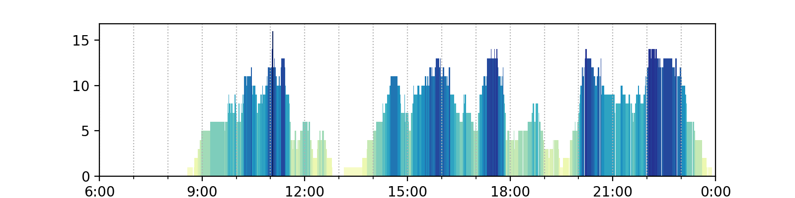
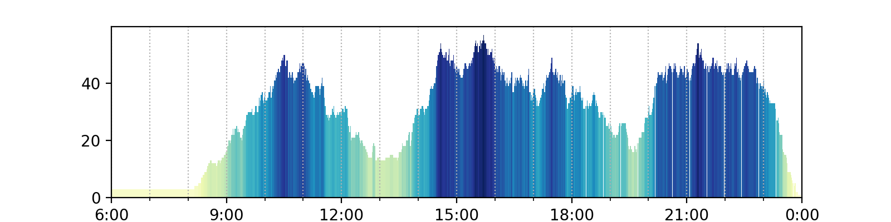
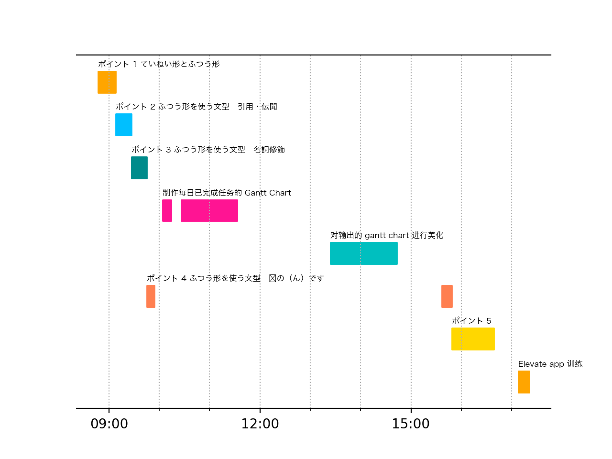
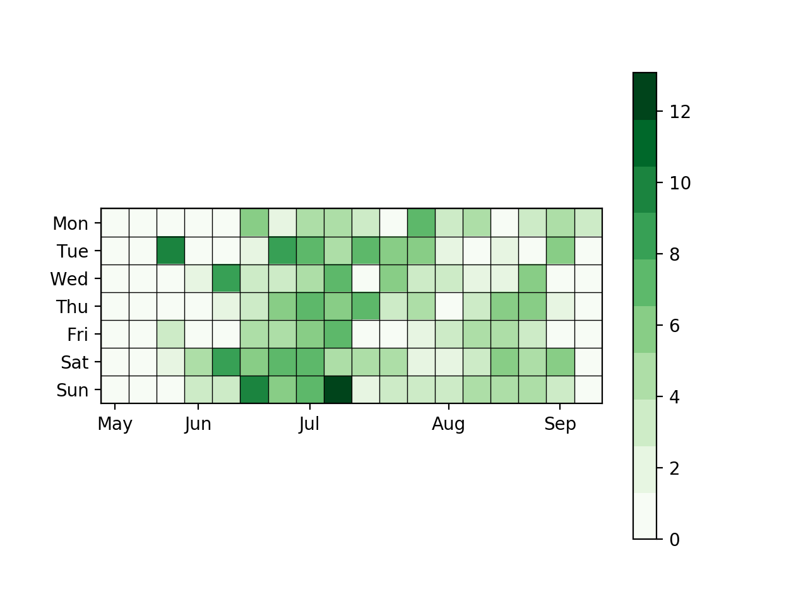
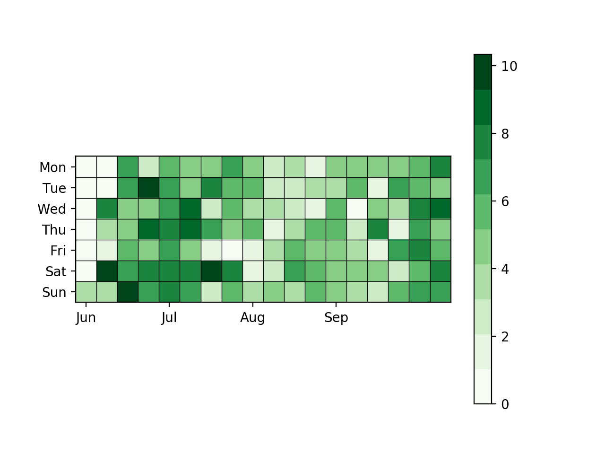

# Omnifocus Visualization

This project is used to visualize the data in the OmniFocus.

> **OmniFocus** is a personal [task manager](https://en.wikipedia.org/wiki/Task_management) by [The Omni Group](https://en.wikipedia.org/wiki/The_Omni_Group) for [macOS](https://en.wikipedia.org/wiki/MacOS) and [iOS](https://en.wikipedia.org/wiki/IOS_(Apple)). The declared goal of the program is to be able to capture thoughts and ideas into [to do lists](https://en.wikipedia.org/wiki/To_do_list).[[4\]](https://en.wikipedia.org/wiki/OmniFocus#cite_note-4) The program uses concepts and techniques described in the book *Getting Things Done* by [David Allen](https://en.wikipedia.org/wiki/David_Allen_(author)). Allen's productivity system is commonly abbreviated as GTD.[[5\]](https://en.wikipedia.org/wiki/OmniFocus#cite_note-5)
>
> — [wikipedia](https://en.wikipedia.org/wiki/OmniFocus)

OmniFocus is a powerful tool, however, there is no visualization tool in OmniFocus. So I write these simple and rough scripts with python and matplotlib.  

## Getting Started

Step 1:

Export `.csv` file from the OmniFocus, rename it as `OmniFocus.csv`, I will provide a sample file which you can use to test these scripts. 

Step 2:

run command in the terminal:

```python
$ python3 efficiency.py
$ python3 gantt.py
$ python3 heapmap.py
```

`efficiency.py` will analyze the tasks you completed and draw a efficiency curve during one day ( average efficiency based on the tasks you completed.)





`ganntt.py` will draw a gantt chart.



`heatmap.py` will draw a heatmap with a GitHub style. 





